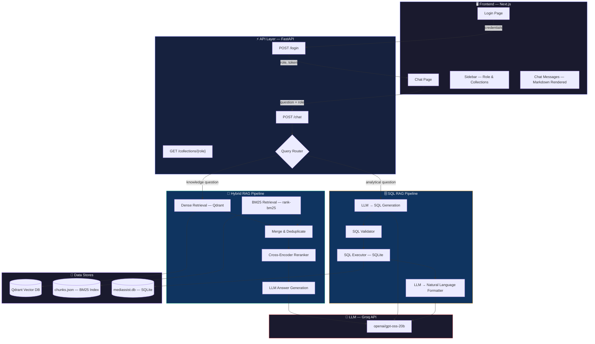
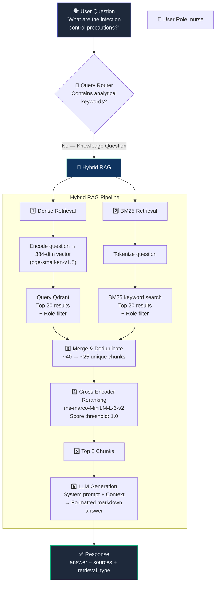
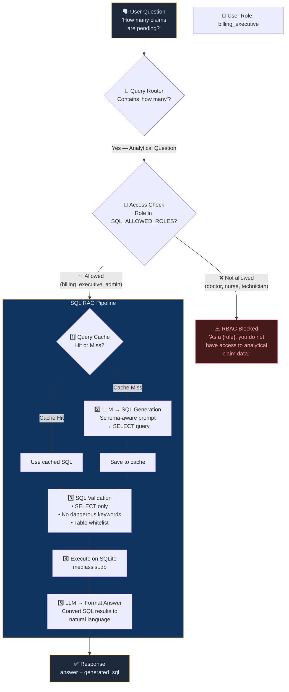
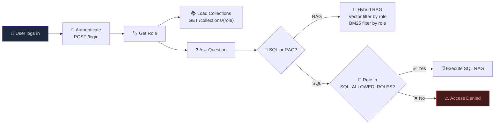

<div align="center">

# 🏥 MediBot — Hospital Knowledge Assistant

**AI-powered RAG system with Role-Based Access Control for hospital staff**

Built with Hybrid RAG (Dense + BM25 + Reranking) • SQL RAG • Groq LLM • Qdrant • Next.js

</div>

---

## 📑 Table of Contents

- [Overview](#-overview)
- [Architecture](#-architecture)
- [Project Structure](#-project-structure)
- [Data Pipeline Flow](#-data-pipeline-flow)
- [Query Flow — Hybrid RAG](#-query-flow--hybrid-rag)
- [Query Flow — SQL RAG](#-query-flow--sql-rag)
- [Role-Based Access Control (RBAC)](#-role-based-access-control-rbac)
- [Tech Stack](#-tech-stack)
- [Setup & Installation](#-setup--installation)
- [How to Run](#-how-to-run)
- [API Endpoints](#-api-endpoints)
- [Demo Accounts](#-demo-accounts)

---

## 🧠 Overview

MediBot is a full-stack Retrieval-Augmented Generation (RAG) system designed for hospital environments. It allows staff members (doctors, nurses, billing executives, technicians, admins) to query hospital knowledge bases — policies, drug formularies, billing codes, equipment manuals — with **role-based access control** ensuring each user only sees documents they are authorized to access.

The system uses two RAG pipelines:

| Pipeline | Purpose | When Used |
|----------|---------|-----------|
| **Hybrid RAG** | Answers knowledge questions from PDF documents | Questions about policies, procedures, protocols |
| **SQL RAG** | Answers analytical/data questions from a SQLite database | Questions with keywords like "how many", "count", "total", "average" |

---

## 🏗 Architecture

### System Architecture



---

## 📁 Project Structure

```
medibot/
│
├── 📂 api/                        # FastAPI backend
│   ├── main.py                    # API endpoints (/login, /chat, /collections)
│   ├── auth.py                    # Demo user credentials
│   ├── models.py                  # Pydantic request models
│   └── roles.py                   # Role → collection mapping
│
├── 📂 ingestion/                  # Document ingestion pipeline
│   ├── loaders.py                 # PDF loading via Docling
│   ├── chunker.py                 # Section & table chunking with RBAC metadata
│   ├── build_chunks.py            # Main chunking script → data/chunks.json
│   └── parse_all.py               # PDF parsing test/preview script
│
├── 📂 retrieval/                  # Hybrid retrieval engine
│   ├── rag_retriever.py           # Dense + BM25 + Reranking pipeline
│   ├── bm25_retriever.py          # BM25 keyword search with role filtering
│   ├── embedder.py                # Embedding model wrapper
│   ├── generate_embeddings.py     # Batch embedding → data/embeddings.json
│   └── reranker.py                # Cross-encoder reranking
│
├── 📂 llm/                       # LLM integration
│   ├── generator.py               # Prompt engineering + Groq API call
│   └── groq_client.py             # Standalone Groq test client
│
├── 📂 sql_rag/                    # SQL RAG pipeline
│   ├── config.py                  # Allowed roles & tables
│   ├── schema.py                  # Database schema (claims, maintenance_tickets)
│   ├── query_router.py            # Keyword-based SQL vs RAG routing
│   ├── sql_generator.py           # LLM → SQL query generation
│   ├── sql_validator.py           # SQL safety validation (SELECT-only, table whitelist)
│   ├── sql_executor.py            # SQLite query execution
│   ├── sql_formatter.py           # LLM → natural language answer formatting
│   ├── query_cache.py             # In-memory query cache
│   └── text_to_sql.py             # Full SQL RAG orchestrator
│
├── 📂 vectorstore/                # Qdrant vector database
│   ├── client_manager.py          # Qdrant client factory
│   ├── qdrant_store.py            # Collection creation (384-dim, cosine)
│   ├── load_vectors.py            # Batch vector upload
│   └── check_collection.py        # Collection inspection utility
│
├── 📂 data/                       # Source documents & processed data
│   ├── 📂 billing/                # billing_codes.pdf, claim_submission_guide.md
│   ├── 📂 clinical/               # diagnostic_reference.pdf, drug_formulary.pdf, treatment_protocols.pdf
│   ├── 📂 nursing/                # infection_control.pdf, icu_nursing_procedures.pdf
│   ├── 📂 equipment/              # equipment_manual.pdf
│   ├── 📂 general/                # staff_handbook.pdf, leave_policy.pdf, code_of_conduct.pdf, general_faqs.pdf
│   ├── 📂 db/                     # mediassist.db (SQLite — claims & maintenance data)
│   ├── chunks.json                # Processed document chunks with metadata
│   └── embeddings.json            # Pre-computed embeddings (384-dim vectors)
│
├── 📂 frontend/                   # Next.js chat UI
│   ├── 📂 app/
│   │   ├── layout.js              # Root layout with Inter font
│   │   ├── page.js                # Login page with demo accounts
│   │   ├── globals.css            # Dark theme design system
│   │   └── 📂 chat/
│   │       └── page.js            # Chat page with sidebar + messages
│   ├── 📂 components/
│   │   ├── Sidebar.js             # User info, role badge, collections
│   │   └── ChatMessage.js         # Markdown-rendered message bubble
│   └── package.json               # Dependencies (next, react-markdown, remark-gfm)
│
├── app.py                         # CLI chat interface (standalone)
├── .env                           # GROQ_API_KEY
└── requirements.txt               # Python dependencies
```

---

## 🔄 Data Pipeline Flow

This is the **one-time ingestion** process that converts raw PDFs into searchable vectors:

```mermaid
flowchart LR
    A["📄 PDF Documents<br/>(12 files across<br/>5 collections)"] --> B["📖 Docling Parser<br/>loaders.py"]
    B --> C{"Document Type?"}
    C -->|"Table-heavy<br/>(billing_codes, drug_formulary...)"| D["📊 Table Chunker<br/>Row-by-row extraction"]
    C -->|"Text-heavy<br/>(policies, manuals...)"| E["📝 Section Chunker<br/>Split by ## headings"]
    D --> F["🏷️ Add Metadata<br/>document, collection,<br/>access_roles, section_title"]
    E --> F
    F --> G["💾 chunks.json<br/>(all chunks with metadata)"]
    G --> H["🧮 Embedding Model<br/>BAAI/bge-small-en-v1.5<br/>384 dimensions"]
    H --> I["💾 embeddings.json<br/>(chunks + vectors)"]
    I --> J["📦 Qdrant Upload<br/>Collection: medibot<br/>Cosine similarity"]

    style A fill:#1e293b,stroke:#6366f1,color:#e2e8f0
    style G fill:#1e293b,stroke:#10b981,color:#e2e8f0
    style I fill:#1e293b,stroke:#f59e0b,color:#e2e8f0
    style J fill:#1e293b,stroke:#8b5cf6,color:#e2e8f0
```



### Steps to Run Ingestion

```bash
# Step 1: Parse PDFs → preview output
python ingestion/parse_all.py

# Step 2: Chunk documents → data/chunks.json
python ingestion/build_chunks.py

# Step 3: Generate embeddings → data/embeddings.json
python retrieval/generate_embeddings.py

# Step 4: Create Qdrant collection
python vectorstore/qdrant_store.py

# Step 5: Upload vectors to Qdrant
python vectorstore/load_vectors.py
```

---

## 🔗 Query Flow — Hybrid RAG

When a user asks a **knowledge question** (e.g., "What are the infection control precautions?"):



### RBAC Enforcement in Hybrid RAG

Access control is enforced at **two levels**:

1. **Dense Retrieval (Qdrant)** — A `FieldCondition` filter on `access_roles` ensures only documents the user's role can access are returned.
2. **BM25 Retrieval** — Each chunk's `access_roles` metadata is checked against the user's role before including in results.

---

## 🗄 Query Flow — SQL RAG

When a user asks an **analytical question** (e.g., "How many claims are pending?"):



### SQL Safety Layers

| Layer | Protection |
|-------|-----------|
| **Access Control** | Only `billing_executive` and `admin` can use SQL RAG |
| **Keyword Routing** | Only questions with analytical keywords ("count", "how many", "total"...) go to SQL |
| **SQL Validation** | Only `SELECT` allowed; `INSERT/UPDATE/DELETE/DROP/ALTER` blocked |
| **Table Whitelist** | Only `claims` and `maintenance_tickets` tables accessible |
| **Query Cache** | Identical questions reuse cached SQL (avoids redundant LLM calls) |

---

## 🔐 Role-Based Access Control (RBAC)

### RBAC Enforcement Flow



### Role → Collection Access Matrix

| Role | clinical | nursing | billing | equipment | general | SQL RAG |
|------|:--------:|:-------:|:-------:|:---------:|:-------:|:-------:|
| **doctor** | ✅ | ✅ | ❌ | ❌ | ✅ | ❌ |
| **nurse** | ❌ | ✅ | ❌ | ❌ | ✅ | ❌ |
| **billing_executive** | ❌ | ❌ | ✅ | ❌ | ✅ | ✅ |
| **technician** | ❌ | ❌ | ❌ | ✅ | ✅ | ❌ |
| **admin** | ✅ | ✅ | ✅ | ✅ | ✅ | ✅ |

### Document → Collection Mapping

| Collection | Documents |
|-----------|-----------|
| `clinical` | `diagnostic_reference.pdf`, `drug_formulary.pdf`, `treatment_protocols.pdf` |
| `nursing` | `infection_control.pdf`, `icu_nursing_procedures.pdf` |
| `billing` | `billing_codes.pdf`, `claim_submission_guide.md` |
| `equipment` | `equipment_manual.pdf` |
| `general` | `staff_handbook.pdf`, `leave_policy.pdf`, `code_of_conduct.pdf`, `general_faqs.pdf` |

### Database Tables (SQL RAG)

| Table | Description | Key Columns |
|-------|-------------|-------------|
| `claims` | Insurance claim records | `claim_id`, `patient_name`, `department`, `claim_type`, `status`, `claimed_amount`, `approved_amount` |
| `maintenance_tickets` | Equipment maintenance tickets | `ticket_id`, `equipment_name`, `issue_type`, `status`, `campus` |

---

## 🛠 Tech Stack

| Layer | Technology | Purpose |
|-------|-----------|---------|
| **Frontend** | Next.js 15, React 19, react-markdown | Chat UI with markdown rendering |
| **Backend** | FastAPI, Uvicorn | REST API with CORS |
| **LLM** | Groq API (`openai/gpt-oss-20b`) | Answer generation, SQL generation, SQL formatting |
| **Embeddings** | `BAAI/bge-small-en-v1.5` (384-dim) | Sentence embeddings for dense retrieval |
| **Reranker** | `cross-encoder/ms-marco-MiniLM-L-6-v2` | Cross-encoder reranking for precision |
| **Vector DB** | Qdrant (local, file-based) | Dense vector storage & similarity search |
| **Keyword Search** | `rank-bm25` (BM25Okapi) | Sparse/keyword-based retrieval |
| **SQL Database** | SQLite | Structured data for analytical queries |
| **PDF Parsing** | Docling | PDF → Markdown + table extraction |
| **Auth** | Session-based (demo) | Role-based demo authentication |

---

## ⚙ Setup & Installation

### Prerequisites

- **Python 3.10+**
- **Node.js 18+** (for frontend)
- **Groq API Key** — get one at [console.groq.com](https://console.groq.com)

### 1. Clone the Repository

```bash
git clone https://github.com/your-username/medibot.git
cd medibot
```

### 2. Create Python Virtual Environment

```bash
python -m venv .venv

# Windows
.venv\Scripts\activate

# macOS/Linux
source .venv/bin/activate
```

### 3. Install Python Dependencies

```bash
pip install fastapi uvicorn python-dotenv groq
pip install sentence-transformers rank-bm25
pip install qdrant-client
pip install docling
```

### 4. Set Up Environment Variables

Create a `.env` file in the project root:

```env
GROQ_API_KEY=your_groq_api_key_here
```

### 5. Run the Ingestion Pipeline (if not already done)

> **Note:** If `data/chunks.json`, `data/embeddings.json`, and `qdrant_data/` already exist, you can skip this step.

```bash
# Step 1: Chunk documents
python ingestion/build_chunks.py

# Step 2: Generate embeddings
python retrieval/generate_embeddings.py

# Step 3: Create Qdrant collection
python vectorstore/qdrant_store.py

# Step 4: Upload vectors
python vectorstore/load_vectors.py
```

### 6. Install Frontend Dependencies

```bash
cd frontend
npm install
cd ..
```

---

## 🚀 How to Run

### Start Both Servers

You need **two terminal windows**:

**Terminal 1 — Backend (FastAPI)**

```bash
cd medibot
.venv\Scripts\activate
uvicorn api.main:app --reload
```

Backend runs at: **http://localhost:8000**

**Terminal 2 — Frontend (Next.js)**

```bash
cd medibot/frontend
npm run dev
```

Frontend runs at: **http://localhost:3000**

### Open the App

1. Open **http://localhost:3000** in your browser
2. Click any **Quick Demo Login** button (or type credentials manually)
3. Start chatting with MediBot!

### CLI Mode (Optional)

You can also chat via terminal without the frontend:

```bash
python app.py
```

---

## 📡 API Endpoints

| Method | Endpoint | Description | Request Body |
|--------|----------|-------------|--------------|
| `GET` | `/health` | Health check | — |
| `POST` | `/login` | Authenticate user | `{ "username": "...", "password": "..." }` |
| `GET` | `/collections/{role}` | Get accessible collections for a role | — |
| `POST` | `/chat` | Send a question | `{ "question": "...", "role": "..." }` |

### Example `/chat` Request & Response

```bash
curl -X POST http://localhost:8000/chat \
  -H "Content-Type: application/json" \
  -d '{"question": "What are the infection control precautions?", "role": "nurse"}'
```

```json
{
  "answer": "**Infection outbreaks require adherence to standard precautions...**\n\n### 1. Outbreak definition\n- An outbreak is **two or more linked cases within 72 hours**.\n\n### 2. Core precautions\n1. **Standard precautions** for all patients...",
  "sources": [
    {
      "source_document": "infection_control.pdf",
      "section_title": "Unknown",
      "collection": "nursing"
    }
  ],
  "retrieval_type": "hybrid_rag",
  "role": "nurse"
}
```

---

## 👥 Demo Accounts

| Username | Password | Role | Collections | SQL Access |
|----------|----------|------|-------------|:----------:|
| `dr.mehta` | `doctor` | Doctor | clinical, nursing, general | ❌ |
| `nurse.priya` | `nurse` | Nurse | nursing, general | ❌ |
| `billing.ravi` | `billing` | Billing Executive | billing, general | ✅ |
| `tech.anand` | `technician` | Technician | equipment, general | ❌ |
| `admin.sys` | `admin` | Administrator | all collections | ✅ |

---

<div align="center">

**Built with ❤️ for healthcare knowledge management**

</div>

